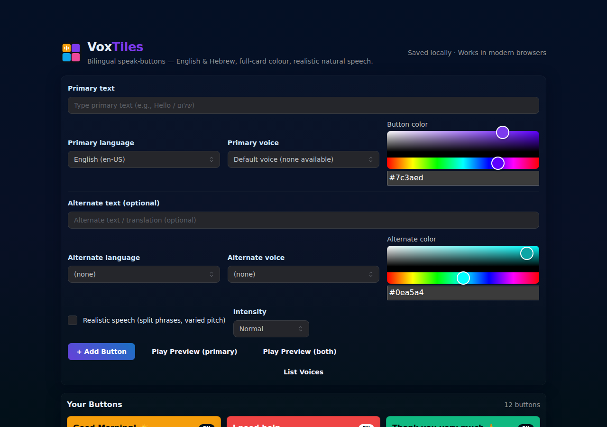
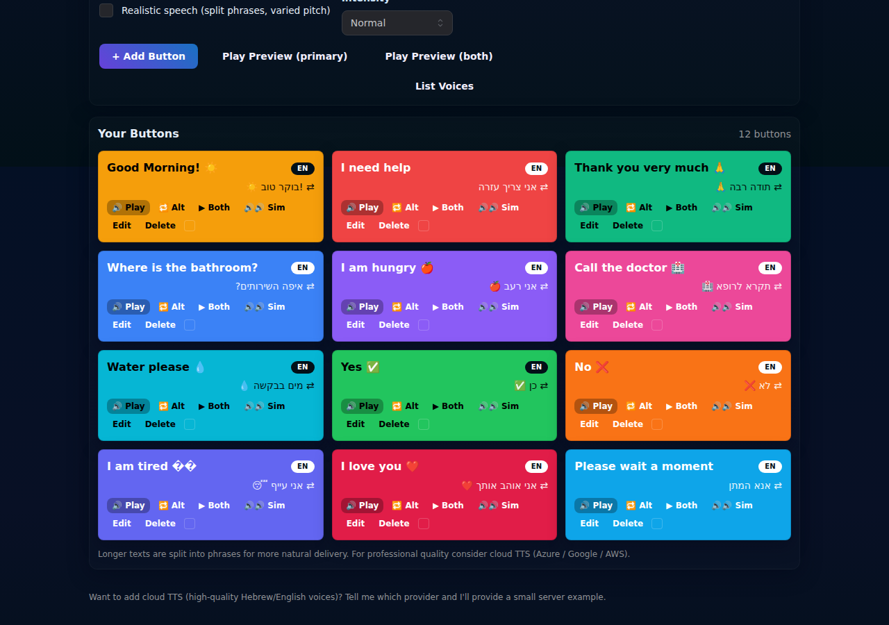
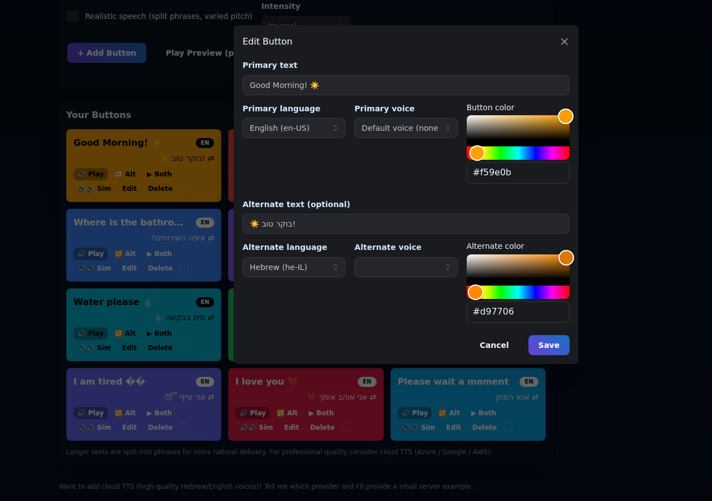
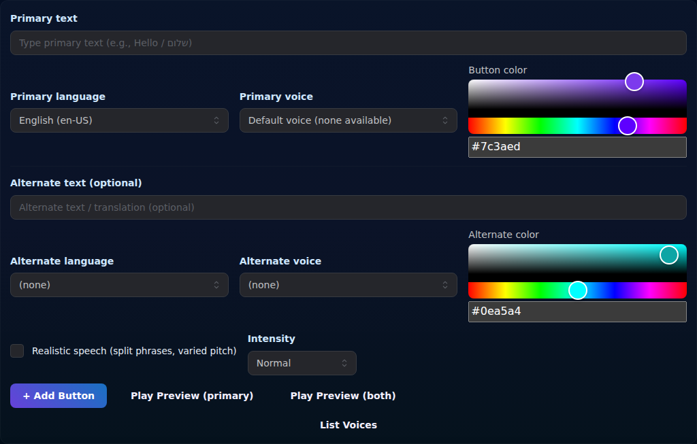
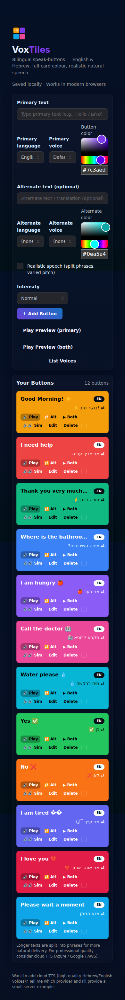

<div align="center">
  
  <h1>VoxTiles</h1>
  <p><strong>Bilingual speak-buttons for English &amp; Hebrew — colorful, persistent, and naturally voiced.</strong></p>

  <p>
    <a href="https://github.com/mauricelubin2014/Maurice_buttons123/actions/workflows/ci.yml">
      
    </a>
    <a href="https://mauricelubin2014.github.io/Maurice_buttons123/">
      
    </a>
    
    
    
  </p>

  
</div>

---

## What is VoxTiles?

VoxTiles is a **browser-based AAC-style communication tool** that lets you create a personal board of colorful, tappable speak-buttons. Each button can hold primary **and** alternate (translated) text — so you can speak the same phrase in English and Hebrew in a single tap.

It uses the browser's built-in **Web Speech API** — no server, no account, no subscription. Everything you create is saved automatically to your browser's `localStorage` and survives page refreshes.

---

## Screenshots

<table>
  <tr>
    <td align="center"><strong>Button Grid</strong></td>
    <td align="center"><strong>Edit Modal</strong></td>
  </tr>
  <tr>
    <td></td>
    <td></td>
  </tr>
  <tr>
    <td align="center"><strong>Create Panel</strong></td>
    <td align="center"><strong>Mobile</strong></td>
  </tr>
  <tr>
    <td></td>
    <td></td>
  </tr>
</table>

---

## ✅ What it does

| Feature | Detail |
|---|---|
| **Colorful tiles** | Each button fills its whole card with your chosen colour; text automatically flips between black and white for contrast |
| **Primary + alternate text** | One button can hold two phrases (e.g. English + Hebrew) |
| **Language & voice selection** | Pick from any voice installed in your browser; simulated Hebrew variants when no native voice is available |
| **Four playback modes** | 🔊 Primary · 🔁 Alternate · ▶ Both (sequential) · 🔊🔊 Sim (simultaneous attempt) |
| **Realistic speech mode** | Splits long text into phrases at sentence/clause boundaries; adds subtle pitch and rate jitter for natural delivery |
| **Intensity control** | Low / Normal / High slider scales phrase pauses and jitter amount |
| **Create** | Form with hex colour picker (`react-colorful`), language selector, voice dropdown, and live preview before saving |
| **Edit** | Full Mantine Modal pre-populated with all button fields; close with Escape |
| **Delete** | Confirm-guarded deletion |
| **Persist across sessions** | `localStorage` via `usehooks-ts` — your buttons survive page refresh and browser restart |
| **Responsive** | 1-column on mobile, 2-column on tablet, 3-column on desktop (Mantine `SimpleGrid`) |
| **Toast feedback** | Success / error / info toasts via `sonner` |
| **Voice debug panel** | Collapsible list of all voices detected by the browser |
| **Dark theme** | Mantine dark colour scheme throughout |

---

## ❌ What it doesn't do

| Limitation | Notes |
|---|---|
| **No cloud TTS** | Uses the browser's built-in Web Speech API only. Voice quality varies by OS and browser — especially for Hebrew on Windows |
| **No account / sync** | Data lives in `localStorage` on one device. There is no cloud sync between devices or browsers |
| **No audio export** | You cannot save speech as an MP3/WAV file |
| **No images on buttons** | Text and colour only — no symbol/picture support (unlike full AAC tools like Proloquo2Go or Cboard) |
| **No drag-to-reorder** | The button grid order is creation order; reordering requires delete + re-create |
| **Simultaneous playback** | The "Sim" mode fires two utterances at once but most browsers queue them sequentially anyway — true simultaneous TTS requires the Web Audio API or a cloud provider |
| **Limited Hebrew voices** | Native Hebrew voices are available on macOS/iOS and some Android devices; Windows typically has none |
| **No offline PWA** | The app is not installed as a Progressive Web App — it requires a network connection on first load from GitHub Pages |
| **Safari quirks** | Web Speech API behaviour varies on Safari; voices may not load on the first visit until a user gesture occurs |

---

## 🏗 Tech stack

| Layer | Library / Tool |
|---|---|
| **UI components** | [`@mantine/core`](https://mantine.dev) v9 — Button, TextInput, Select, Checkbox, Badge, Tooltip, Card, Modal, SimpleGrid, Collapse, ScrollArea |
| **State toggles** | [`@mantine/hooks`](https://mantine.dev/hooks) — `useDisclosure` |
| **Forms** | [`react-hook-form`](https://react-hook-form.com) + `useWatch` |
| **Colour picker** | [`react-colorful`](https://github.com/omgovich/react-colorful) — `HexColorPicker` + `HexColorInput` |
| **Toasts** | [`sonner`](https://sonner.emilkowal.ski) |
| **Persistence** | [`usehooks-ts`](https://usehooks-ts.com) — `useLocalStorage` |
| **IDs** | [`nanoid`](https://github.com/ai/nanoid) |
| **Speech** | Browser Web Speech API (`SpeechSynthesisUtterance`) |
| **Build** | [Vite](https://vite.dev) 8 + [`@vitejs/plugin-react`](https://github.com/vitejs/vite-plugin-react) |
| **Tests** | [Vitest](https://vitest.dev) + [React Testing Library](https://testing-library.com/react) |
| **Lint** | ESLint 10 + `eslint-plugin-react-hooks` + `eslint-plugin-react-refresh` |
| **CI/CD** | GitHub Actions — lint → test → build on every push/PR; auto-deploy to GitHub Pages on `main` |

---

## 🚀 Local development

### Prerequisites

- **Node.js 18+** (tested on Node 22)
- **npm 9+** (comes with Node)
- A modern browser with Web Speech API support (Chrome, Edge, Safari, Firefox)

### Getting started

```bash
# 1 — clone the repository
git clone https://github.com/mauricelubin2014/Maurice_buttons123.git
cd Maurice_buttons123

# 2 — install dependencies
npm install

# 3 — start the dev server (hot-module reload)
npm run dev
```

The app will be available at **http://localhost:5173/Maurice_buttons123/**.

### Available scripts

| Command | What it does |
|---|---|
| `npm run dev` | Start Vite dev server with HMR at `localhost:5173` |
| `npm run build` | Production build — output in `dist/` |
| `npm run preview` | Serve the production build locally at `localhost:4173` |
| `npm run lint` | Run ESLint across all source files |
| `npm run test` | Run Vitest in watch mode |
| `npm run test:run` | Run Vitest once (used in CI) |
| `npm run coverage` | Run tests and generate a V8 coverage report in `coverage/` |

### Project structure

```
src/
├── components/
│   ├── ButtonCard.jsx      # Single saved speak-button tile
│   ├── ButtonsGrid.jsx     # Responsive grid of all buttons
│   ├── CreatePanel.jsx     # Add-button form (react-hook-form + react-colorful)
│   ├── EditModal.jsx       # Mantine Modal for editing an existing button
│   └── VoicesDebug.jsx     # Collapsible voice list panel
├── hooks/
│   ├── useButtons.js       # CRUD over localStorage (usehooks-ts)
│   ├── useLocalStorage.js  # Thin re-export / type helper
│   └── useVoices.js        # Loads + subscribes to speechSynthesis.getVoices()
├── utils/
│   ├── color.js            # contrastTextColor() — WCAG luminance calc
│   ├── speech.js           # speakText / speakBothSequential / speakBothSimultaneous
│   └── voices.js           # buildVoiceOptions() + simulated Hebrew variants
├── __tests__/              # Vitest + RTL test files
├── App.jsx                 # Root component
├── main.jsx                # React entry — MantineProvider + Toaster
├── App.css                 # Panel / global layout helpers
├── index.css               # Body/root reset
└── setupTests.js           # jsdom mocks for Mantine (matchMedia, ResizeObserver…)
```

### Running tests

```bash
# Watch mode (during development)
npm run test

# Single run (as in CI)
npm run test:run

# With coverage
npm run coverage
```

All 51 tests cover utility functions (`color`, `speech`, `voices`), the `useLocalStorage` hook, and every component.

### Seeding demo data

To see the app populated with demo buttons (as shown in the screenshots), paste the following into your browser's DevTools console while on the app:

```js
localStorage.setItem('customSpeakButtons_v1_realistic_color', JSON.stringify([
  { id:'d01', text:'Good Morning! ☀️', lang:'en-US', voiceURI:'', color:'#f59e0b', altText:'!בוקר טוב ☀️', altLang:'he-IL', altVoiceURI:'', altColor:'#d97706' },
  { id:'d02', text:'I need help',       lang:'en-US', voiceURI:'', color:'#ef4444', altText:'אני צריך עזרה',  altLang:'he-IL', altVoiceURI:'', altColor:'#dc2626' },
  { id:'d03', text:'Thank you 🙏',      lang:'en-US', voiceURI:'', color:'#10b981', altText:'תודה רבה 🙏',   altLang:'he-IL', altVoiceURI:'', altColor:'#059669' },
  { id:'d04', text:'Water please 💧',   lang:'en-US', voiceURI:'', color:'#06b6d4', altText:'מים בבקשה 💧',  altLang:'he-IL', altVoiceURI:'', altColor:'#0891b2' },
  { id:'d05', text:'Yes ✅',             lang:'en-US', voiceURI:'', color:'#22c55e', altText:'כן ✅',          altLang:'he-IL', altVoiceURI:'', altColor:'#16a34a' },
  { id:'d06', text:'No ❌',              lang:'en-US', voiceURI:'', color:'#f97316', altText:'לא ❌',          altLang:'he-IL', altVoiceURI:'', altColor:'#ea580c' },
]))
```

Then refresh the page.

---

## ⚙️ CI / CD

Two GitHub Actions workflows run on every push:

### CI (`ci.yml`) — runs on every push and PR

```
npm ci → npm run lint → npm run test:run → npm run build
```

### Deploy (`deploy.yml`) — runs on push to `main`

```
npm ci → npm run build → peaceiris/actions-gh-pages → gh-pages branch
```

Live site: **https://mauricelubin2014.github.io/Maurice_buttons123/**

---

## 📋 BMAD planning artifacts

This project was planned and built using the [BMad Method](https://github.com/bmadcode/bmad-method) agent workflow:

| Artifact | Path |
|---|---|
| Product Requirements Document | `_bmad-output/planning-artifacts/prd.md` |
| Architecture | `_bmad-output/planning-artifacts/architecture.md` |
| Epics & Stories | `_bmad-output/implementation-artifacts/epics-and-stories.md` |

---

## License

MIT © Maurice Lubin

